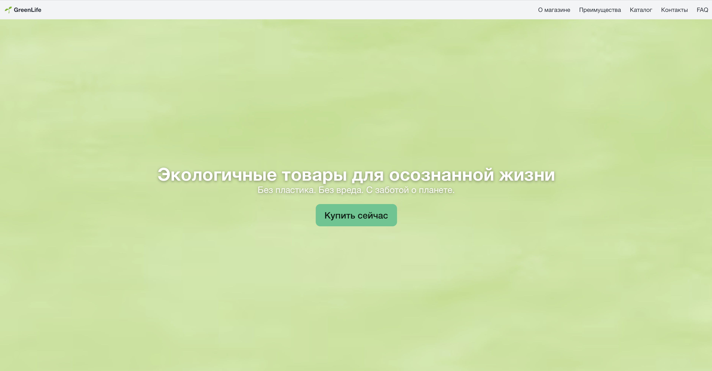
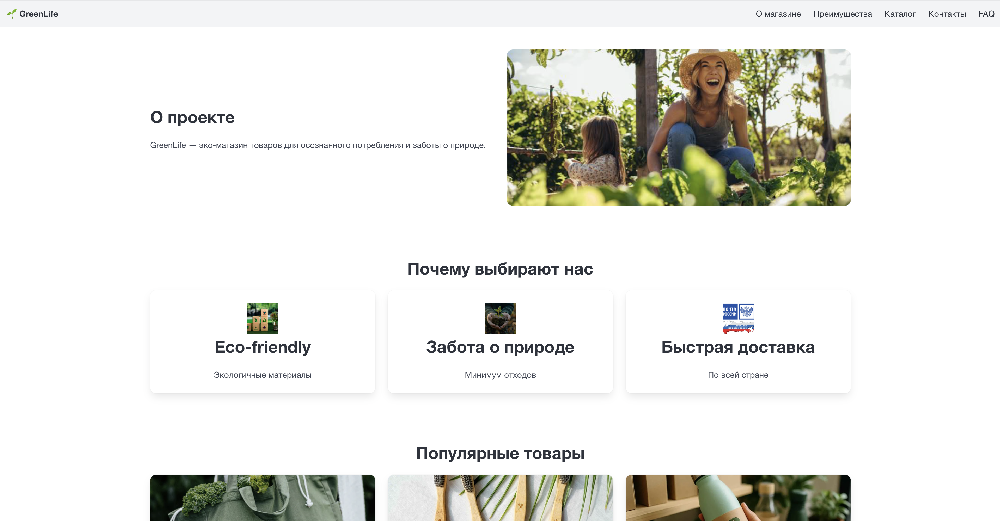
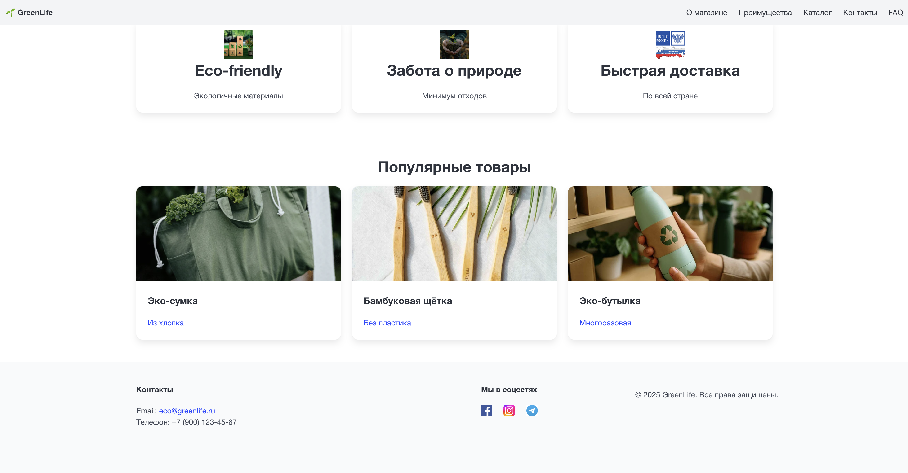
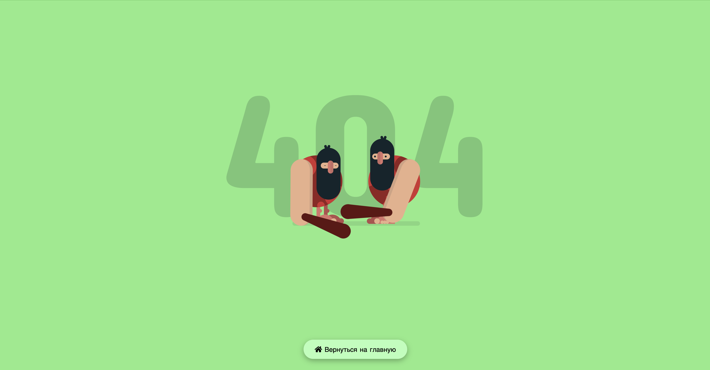
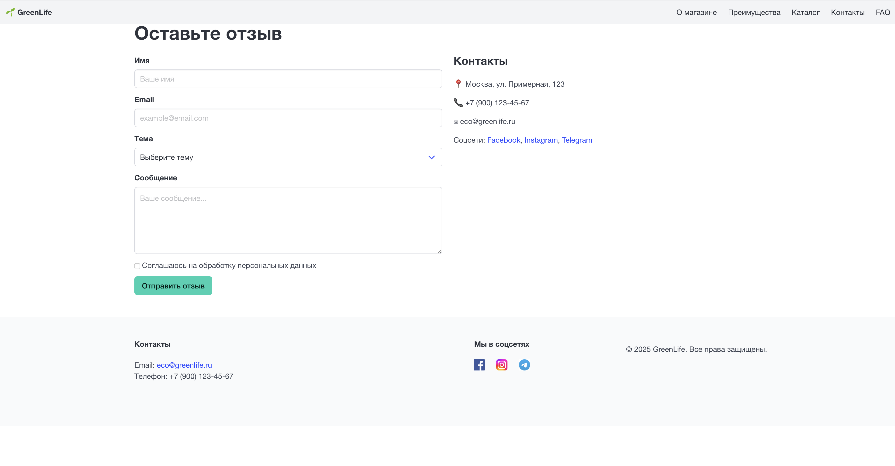
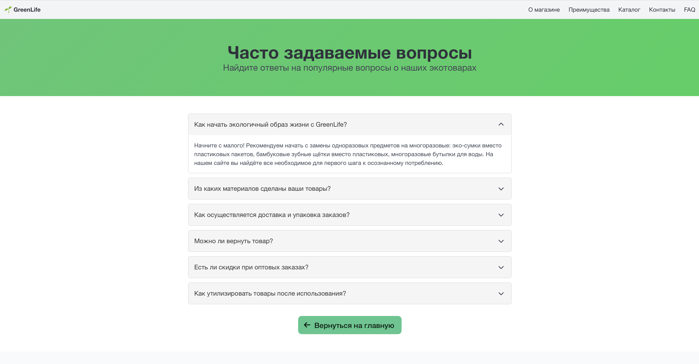

# 🌱 Эко-магазин GreenLife

## 📚 Практическое занятие 7: Работа с CSS-фреймворками
**Тема проекта:** Интернет-магазин экологичных товаров

## 🚀 Демо

<div align="center">

### 🌐 **[Открыть на GitHub Pages](https://katrinkh.github.io/7-8pr/)**

</div>

## 📁 Структура проекта

```
GreenLife/
├── assets/
│   ├── images/
│   └── styles/
│           └── styles.css
├── 404.html
├── contacts.html
├── faq.html
├── index.html
└── README.md
```

## 📸 Скриншоты

<div align="center">





## 📚 Практическое занятие 8: Работа с CSS-фреймворками 2



</div>
